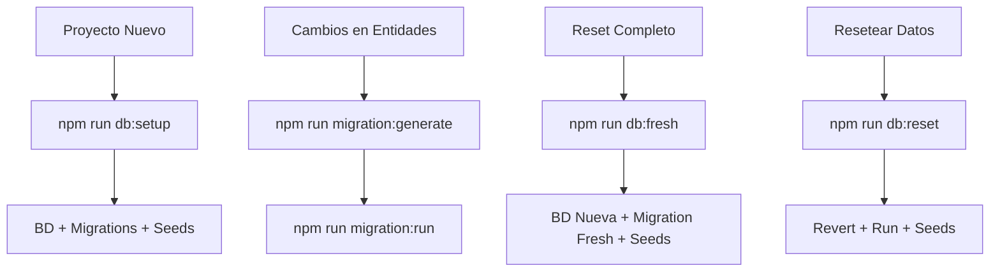

# 🗄️ Comandos de Base de Datos

Guía completa de comandos NPM para gestionar la base de datos, migraciones y seeds.

---

## 📋 Índice Rápido

| Comando | Descripción |
|---------|-------------|
| `npm run db:create` | Crear base de datos |
| `npm run db:drop` | Eliminar base de datos |
| `npm run db:fresh` | **Reset completo** (drop → create → fresh migration → run → seed) |
| `npm run db:setup` | Setup inicial (create → migration → seed) |
| `npm run db:reset` | Reset suave (revert → migration → seed) |
| `npm run migration:fresh` | Regenerar migración desde cero |
| `npm run migration:generate` | Generar migración desde cambios |
| `npm run migration:run` | Ejecutar migraciones pendientes |
| `npm run migration:revert` | Revertir última migración |
| `npm run migration:show` | Mostrar estado de migraciones |
| `npm run seed:run` | Ejecutar seeds |

---

## 🆕 Comandos Nuevos

### `npm run db:create`
**Crea la base de datos si no existe**

```bash
npm run db:create
```

**Uso:**
- Primera vez configurando el proyecto
- Después de ejecutar `db:drop`
- En entornos donde la DB no existe

**Output:**
```
🔍 Verificando si existe la base de datos "audit_core_db"...
🔨 Creando base de datos "audit_core_db"...
✅ Base de datos "audit_core_db" creada exitosamente.
```

---

### `npm run db:drop`
**Elimina completamente la base de datos**

```bash
npm run db:drop
```

**⚠️ ADVERTENCIA**: Esto elimina TODOS los datos. Úsalo solo en desarrollo.

**Uso:**
- Empezar desde cero
- Limpiar base de datos corrupta
- Antes de regenerar migraciones

**Output:**
```
🔍 Verificando si existe la base de datos "audit_core_db"...
🔌 Terminando conexiones activas a "audit_core_db"...
🗑️  Eliminando base de datos "audit_core_db"...
✅ Base de datos "audit_core_db" eliminada exitosamente.
```

---

### `npm run migration:fresh`
**Regenera la migración completa desde cero**

```bash
npm run migration:fresh
```

**Qué hace:**
1. Elimina TODAS las migraciones existentes en `src/@core/database/migrations/`
2. Genera una nueva migración `InitialSchema` con el estado actual de las entidades

**Uso:**
- Cuando tienes muchas migraciones y quieres consolidarlas
- Desarrollo inicial antes de producción
- Limpiar historial de migraciones

**Output:**
```
🔍 Verificando carpeta de migraciones...
🗑️  Eliminando migraciones antiguas...
   ❌ Eliminado: 1767384027398-InitialSchema.ts
✅ 1 migración(es) eliminada(s).

🔨 Generando nueva migración "InitialSchema"...
✅ Migración "InitialSchema" generada exitosamente.

📝 Próximos pasos:
   1. Revisar la migración generada
   2. Ejecutar: npm run migration:run
   3. O ejecutar: npm run db:fresh (para reset completo)
```

---

### `npm run db:fresh`
**🚀 Reset completo: Baja BD, crea nueva, regenera migración, ejecuta todo**

```bash
npm run db:fresh
```

**Qué hace (en orden):**
1. `db:drop` - Elimina la BD
2. `db:create` - Crea la BD nueva
3. `migration:fresh` - Regenera migración desde cero
4. `migration:run` - Ejecuta la nueva migración
5. `seed:run` - Ejecuta seeds

**Uso:**
- **Desarrollo**: Empezar completamente desde cero
- **Reset total**: Cuando quieres estado limpio
- **Después de cambios grandes**: Consolidar migraciones

**⚠️ ADVERTENCIA**:
- Elimina TODOS los datos
- Solo usar en desarrollo
- NUNCA en producción

**Ejemplo de uso:**
```bash
# Hiciste cambios en varias entidades y quieres empezar limpio
npm run db:fresh
```

---

## 🔄 Comandos Actualizados

### `npm run db:setup`
**Setup inicial: Crea BD, ejecuta migraciones y seeds**

```bash
npm run db:setup
```

**Qué hace (en orden):**
1. `db:create` - Crea la BD si no existe
2. `migration:run` - Ejecuta migraciones pendientes
3. `seed:run` - Ejecuta seeds

**Uso:**
- Primera vez configurando el proyecto
- Después de clonar el repositorio
- Setup en nuevos entornos

**Antes vs Ahora:**
```bash
# ❌ Antes: Fallaba si la BD no existía
npm run db:setup  # Error: database does not exist

# ✅ Ahora: Crea la BD automáticamente
npm run db:setup  # Crea → Migra → Seed
```

---

### `npm run db:reset`
**Reset suave: Revierte migraciones, las ejecuta de nuevo, ejecuta seeds**

```bash
npm run db:reset
```

**Qué hace (en orden):**
1. `migration:revert` - Revierte última migración
2. `migration:run` - Ejecuta migraciones de nuevo
3. `seed:run` - Ejecuta seeds

**Uso:**
- Recargar datos sin perder el esquema
- Probar migraciones
- Resetear datos a estado inicial

---

## 🎯 Comandos de Migraciones

### `npm run migration:generate`
**Genera migración desde cambios en entidades**

```bash
npm run migration:generate -- src/@core/database/migrations/AddUserRoles
```

**Uso:**
- Después de modificar/agregar entidades
- TypeORM detecta diferencias automáticamente

---

### `npm run migration:run`
**Ejecuta migraciones pendientes**

```bash
npm run migration:run
```

**Uso:**
- Aplicar migraciones nuevas
- Actualizar esquema de BD

---

### `npm run migration:revert`
**Revierte la última migración ejecutada**

```bash
npm run migration:revert
```

**Uso:**
- Deshacer última migración
- Corregir errores

---

### `npm run migration:show`
**Muestra estado de migraciones**

```bash
npm run migration:show
```

**Output:**
```
[X] InitialSchema (executed)
[ ] AddUserRoles (pending)
```

---

## 🌱 Comandos de Seeds

### `npm run seed:run`
**Ejecuta seeds para poblar la BD con datos iniciales**

```bash
npm run seed:run
```

**Uso:**
- Cargar datos de prueba
- Datos iniciales (usuarios admin, roles, etc.)

---

## 📊 Flujos de Trabajo Comunes

### 🆕 Setup Inicial (Primera Vez)

```bash
# 1. Configura .env con DATABASE_URL o DB_*
# 2. Ejecuta setup
npm run db:setup

# ✅ Resultado:
# - Base de datos creada
# - Migraciones ejecutadas
# - Seeds ejecutados
```

---

### 🔄 Desarrollo Diario

**Hiciste cambios en entidades:**
```bash
# 1. Genera migración
npm run migration:generate -- src/@core/database/migrations/MyCambio

# 2. Revisa la migración generada

# 3. Ejecuta migración
npm run migration:run
```

**Quieres resetear datos:**
```bash
npm run db:reset
```

---

### 🧹 Empezar Desde Cero (Reset Completo)

**Opción 1: Con regeneración de migración**
```bash
npm run db:fresh

# ✅ Resultado:
# - BD eliminada
# - BD creada nueva
# - Migración regenerada desde cero
# - Migración ejecutada
# - Seeds ejecutados
```

**Opción 2: Sin regenerar migración**
```bash
npm run db:drop
npm run db:setup

# ✅ Resultado:
# - BD eliminada
# - BD creada nueva
# - Migraciones existentes ejecutadas
# - Seeds ejecutados
```

---

### 🔧 Consolidar Migraciones

**Tienes muchas migraciones y quieres una sola:**
```bash
# 1. Regenerar migración (elimina viejas, crea nueva)
npm run migration:fresh

# 2. Aplicar el reset completo
npm run db:fresh
```

---

## ⚠️ Advertencias Importantes

### 🚫 NUNCA en Producción

Estos comandos **NUNCA** deben usarse en producción:
- ❌ `npm run db:drop`
- ❌ `npm run db:fresh`
- ❌ `npm run migration:fresh`
- ❌ `npm run db:reset`

### ✅ Seguros en Producción

Estos comandos SÍ son seguros en producción:
- ✅ `npm run migration:run` - Aplicar migraciones nuevas
- ✅ `npm run migration:show` - Ver estado

### 🔒 Backups

Antes de operaciones destructivas, haz backup:
```bash
# PostgreSQL backup
pg_dump -U postgres audit_core_db > backup.sql

# Restaurar
psql -U postgres audit_core_db < backup.sql
```

---

## 🐛 Troubleshooting

### Error: database does not exist

**Solución:**
```bash
npm run db:create
```

### Error: database is being accessed by other users

**Solución:**
```bash
# El script db:drop automáticamente termina conexiones
npm run db:drop
```

### Migración no se puede revertir

**Solución:**
```bash
# Drop y setup de nuevo
npm run db:drop
npm run db:setup
```

---

## 📝 Resumen de Flujos



---

## 🎯 Cheat Sheet

```bash
# Setup inicial
npm run db:setup

# Reset completo (desarrollo)
npm run db:fresh

# Reset suave (datos)
npm run db:reset

# Crear BD
npm run db:create

# Eliminar BD (⚠️ cuidado)
npm run db:drop

# Regenerar migración
npm run migration:fresh

# Generar migración desde cambios
npm run migration:generate -- src/@core/database/migrations/NombreMigracion

# Ejecutar migraciones
npm run migration:run

# Ver estado
npm run migration:show
```

---

**Última actualización**: Enero 2026
**Autor**: @limberg
